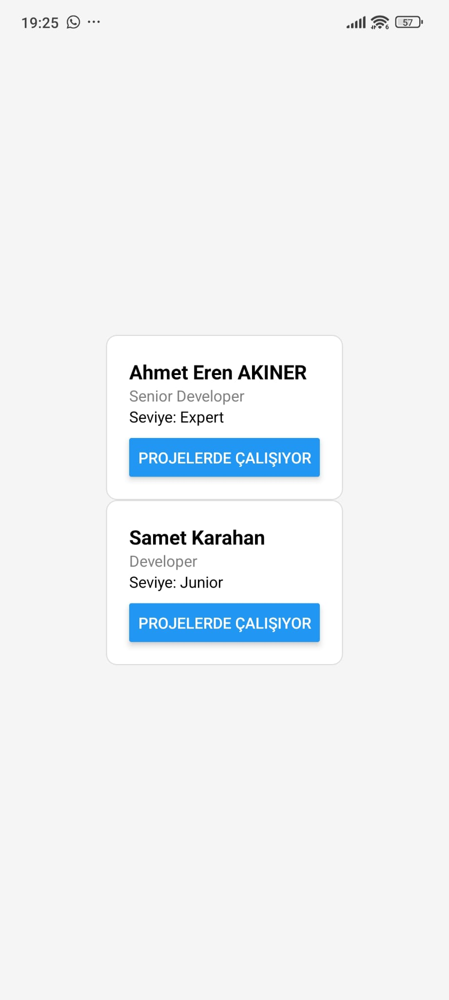
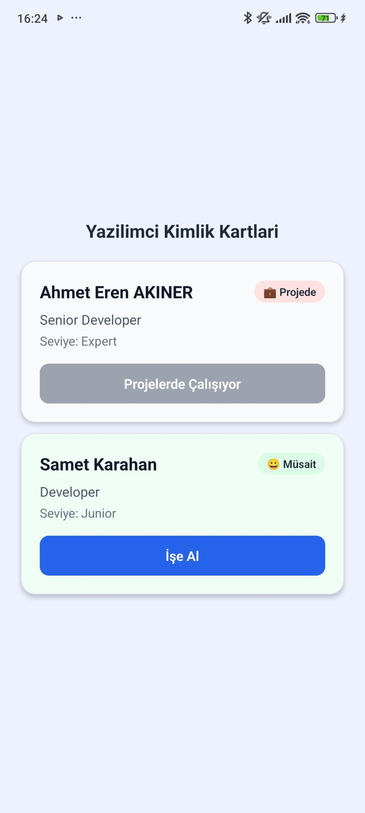

# Yazilimci Kimlik Karti (React Native + Expo)

Bu proje, React Native temel kavramlarini (JSX, Component, Props, State) uygulamali olarak pekistirmek icin gelistirildi.  
Senaryo: `Yazilimci Kimlik Karti`.

## Proje Amaci

- `name`, `title`, `level` proplari ile gelistirici profilini gostermek
- `musaitMi` state'i ile ise alinma durumunu takip etmek
- Buton etiketini state'e gore dinamik degistirmek

## Kullanilan Teknolojiler

- React Native
- Expo
- TypeScript

## Kurulum ve Calistirma

```bash
npm install
npx expo start
```

Telefon ile calistirmak icin Expo Go ile terminaldeki QR kodu okutun.

## Teslim Icerigi 

- **Projenin amaci ve oyunlastirma ozellikleri:** `Proje Amaci` ve `Asama 3 - Challenge 04` bolumlerinde detayli olarak yer alir.
- **Adim adim nasil calistirilir:**  
  1. `npm install`  
  2. `npx expo start`  
  3. Expo Go ile QR kodu okut
- **Indirilebilir APK dosyasi linki/konumu:** [DevKimlik.apk](./apk/DevKimlik.apk)  
  (APK dosyasi bu konuma eklendi.)
- **1 dakikalik YouTube tanitim videosu:** [DevKimlik Challenge 04 Demo](https://youtube.com/shorts/kP7aRupgbbU?feature=share)

## Asama 1 - Temel Prototip

Bu asamada component, props ve state yapisi ilk haliyle kuruldu.

### Ekran Goruntusu



### AI Prompt Ozeti

Adim 1 surecinde en etkili buldugum prompt:

> "Profesyonel bir yazilimci bunu nasil hallederdi, once bunu mu yapardi yoksa UserCard.tsx dosyasini yazip sonra mi ilgilenirdi?"

Bu prompt sayesinde sadece kod uretmek yerine strateji ve metodoloji tarafini da dusunmeyi ogrendim.  
AI'dan "ne yazayim?"dan once "nasil yaklasayim?" sorusunun daha degerli oldugunu gordum.

## Asama 2 - AI ile Iterasyon ve Iyilestirme

Bu asamada kod, "senior developer dokunusu" ile modernlestirildi ve refactor edildi.

### Yapilan Iyilestirmeler

- Flexbox ile duzenli ve ortali yerlesim
- Modern kart tasarimi (radius, shadow, spacing, renk hiyerarsisi)
- `musaitMi` durumuna gore dinamik emoji ve durum rozeti
- Duruma gore kart arka plan tonu ve buton rengi degisimi
- Butonun tek seferlik aksiyon mantigina uygun pasiflestirilmesi
- Clean Code refactor:
  - Prop tipi `UserCardProps` olarak ayrildi
  - Magic string'ler sabitlere tasindi
  - Hesaplanmis ara degiskenlerle JSX sadeleştirildi
  - Inline style kullanimi kaldirildi

### Ekran Goruntusu



### Bu Asamada Kullanilan Prompt

> "Bu kodu Flexbox kullanarak ortala ve modern bir arayuz tasarimi (StyleSheet) ekle.  
> Duruma gore degisen dinamik emojiler veya arka plan renkleri ekle.  
> Yazdigim bu kodu 'Clean Code' prensiplerine gore refactor et ve bana neleri iyilestirdigini acikla."

### Ogrendigim Kisa Not (1-2 cumle)

State degisimi yalnizca metin degistirmekle sinirli kalmiyor; renk, emoji ve buton davranisina da yansitildiginda kullaniciya daha guclu geri bildirim veriyor.  
Ayrica temiz isimlendirme ve ara degiskenler, component buyudugunde kodun okunabilirligini ciddi sekilde artiriyor.

## Asama 3 - Challenge 04 (Final Gelistirmeler)

Bu asamada uygulama `DevKimlik` urun kimligine donusturuldu ve yeni ozellikler eklendi.

### Oyunlastirma ve Ise Alim Sistemi

- XP, bonus XP, level ve progress bar
- Basarimlar (achievement) sistemi
- `Onerilen Aday` ozelligi ve bonus XP

### Aday Yonetimi

- `Ise Alim` ve `Aday Ekle` ekran gecisi
- Aday ekleme formu (detay alanlari ile)
- Aday detay inceleme modal'i
- Aday silme paneli

### Arama ve Geri Bildirim

- Arama kutusu (isim, unvan, seviye, lokasyon, skill)
- Oneri chip'leri ile hizli filtreleme
- Ozellestirilmis silme onay modal'i
- Silme sonrasi markali `Undo Toast` (geri al)

### Kod Mimarisi (Clean Code)

- Moduler component yapisi
- `hooks`, `constants`, `types` ayrimi
- Config-driven kurallar ile gelistirilebilir yapi

### Challenge 04 Video

- YouTube (Unlisted): [DevKimlik Challenge 04 Demo](https://youtube.com/shorts/kP7aRupgbbU?feature=share)

## Kodun Son Hali (Referans Dosyalar)

Teslim icin ana kod dosyalari:

- `App.tsx`
- `src/components/UserCard.tsx`

